<!--
  ╔══════════════════════════════════════════════════════════════╗
  ║  BEFORE YOU PUSH                                             ║
  ║  1. Repo name must be exactly: vishnuvardhan2005-m           ║
  ║  2. Replace every  href="#"  / (#)  link with your own URL.  ║
  ║  3. Run the Action once (Actions tab) to create the snake.   ║
  ╚══════════════════════════════════════════════════════════════╝
-->

 

 

  

  

<a href="#who"><b>👋 Who I Am</b></a> &nbsp;·&nbsp;
<a href="#exp"><b>💼 Experience</b></a> &nbsp;·&nbsp;
<a href="#stack"><b>🧰 Stack</b></a> &nbsp;·&nbsp;
<a href="#builds"><b>🚀 Builds</b></a> &nbsp;·&nbsp;
<a href="#stats"><b>📊 Analytics</b></a> &nbsp;·&nbsp;
<a href="#wins"><b>🏆 Wins</b></a> &nbsp;·&nbsp;
<a href="#contact"><b>📬 Contact</b></a>

 

## 👋 Who I Am

> **Click around — everything below expands.** Pick the lens that fits you.

<b>⚡ &nbsp;The 10-second version</b>

 

<table>
<tr><td width="150"><b>🧑‍💻 Role</b></td><td>MERN Stack Developer — I own features from UI to API to database to deployment</td></tr>
<tr><td><b>🏢 Right now</b></td><td>Web Developer Intern @ <b>Robomonk Technologies</b> (remote), building an LMS platform</td></tr>
<tr><td><b>📍 Based in</b></td><td>Andhra Pradesh, India 🇮🇳</td></tr>
<tr><td><b>🎓 Studying</b></td><td>B.Tech CSE, NRI Institute of Technology · CGPA <b>8.43</b> · Class of 2027</td></tr>
<tr><td><b>🛠️ Sweet spot</b></td><td>Secure auth · RBAC · REST APIs · dashboards · responsive UI</td></tr>
<tr><td><b>🤖 Side quest</b></td><td>AI-integrated apps with the Gemini API and n8n automations</td></tr>
</table>

<b>🎭 &nbsp;Choose your lens</b> &nbsp;(recruiter · collaborator · fellow dev)

 

&nbsp;&nbsp;👔 <b>I'm hiring</b>

 

**What you get:** an engineer who has already shipped on a live product, not just tutorials.

| | |
|---|---|
| 🚢 **Ownership** | 3+ features taken UI → API → MongoDB → testing → deployment, on time every sprint |
| ⚡ **Performance** | ~40% faster page loads on the LMS platform |
| 🔐 **Security mindset** | Firebase Auth, JWT, protected routes and role-based access control |
| ☁️ **Cloud** | Migrated a live LMS platform to AWS |
| 📈 **Impact** | +35% learner engagement, ~60% less manual content work |

**Next step →** [email me](mailto:musunuruvishnuv@gmail.com) · open to full-stack roles and internships.

&nbsp;&nbsp;🤝 <b>I want to collaborate</b>

 

I enjoy building:

- 🎓 **EdTech & LMS products** — dashboards, progress tracking, gamification
- 🤖 **AI-powered web apps** — forecasting, automation, Gemini-driven features
- 🛒 **Commerce & real-time apps** — carts, orders, live inventory

Hackathon team, open-source idea, or a product that needs a full-stack hand? Ping me — I answer fast.

&nbsp;&nbsp;🧑‍🔧 <b>I'm a fellow developer</b>

 

How I like to build:

1. **API first** — clean REST contracts before pixels
2. **Secure by default** — auth, protected routes and RBAC from day one, not as an afterthought
3. **Own it end to end** — if I write the feature, I also debug, test and ship it
4. **Measure it** — page-load and engagement numbers over vibes

Curious about how I structured the LMS or the Smart Canteen forecasting pipeline? Ask away.

<b>🎲 &nbsp;Fun facts</b>

 

- 🏗️ Moved a **live** LMS to AWS and lived to tell the tale
- 🥇 Won a college-level technical quiz — I like knowing *why* things work
- ☕ Runs on coffee and clean commits
- 🥈 Placed 2nd among **120 teams** at the Hyper Web Hackathon

 

## 💼 Experience

<table width="100%">
<tr>
<td>

### 🏢 Web Developer Intern — Robomonk Technologies
**March 2026 – Present** &nbsp;·&nbsp; 🌍 Remote

<b>🏗️ LMS platform</b> — React + Vite + Node/Express + MongoDB

 
Built and maintained the core learning platform, cutting page-load time by roughly 40%. Also handled the migration of the live platform to AWS.

<b>📊 Student learning dashboard</b>

 
Progress tracking, streaks, badges and activity monitoring — lifted engagement by 35%.

<b>🛠️ CMS + admin dashboard</b>

 
Manages 25+ courses, quizzes, learning paths and users, replacing about 60% of the manual content operations.

<b>🔐 Auth & authorization</b>

 
Firebase Auth, JWT, protected routes, RBAC and RESTful APIs powering separate user and admin workflows.

<b>🚀 End-to-end ownership</b>

 
3+ features shipped UI → API → MongoDB → debugging → testing → deployment, on schedule each sprint.

</td>
</tr>
</table>

 

## 🧰 Tech Arsenal

**Frontend** 

**Backend & Data** 

**Cloud & Tooling** 

**AI & Automation** 

 

## 🚀 Featured Builds

<table width="100%">
<tr>
<td width="33%" valign="top">

### 🍽️ Smart Canteen
**AI demand forecasting**

Predicts meal demand from historical sales, weather, events and foot traffic using the Gemini API. REST APIs, MongoDB aggregation pipelines and analytics dashboards.

`Next.js` `TypeScript` `Node.js` `Express` `MongoDB` `Gemini API` `Recharts`

[**💻 Source →**](#)

</td>
<td width="33%" valign="top">

### 🛍️ Style-Cart
**Full-stack e-commerce**

User and admin modules with secure auth, full CRUD and role-based access control. Deployed on Vercel.

`React` `Redux` `Tailwind` `Node.js` `Express` `MongoDB`

[**🔗 Live →**](#) &nbsp;·&nbsp; [**💻 Source →**](#)

</td>
<td width="33%" valign="top">

### 🍬 SweetHaven
**Real-time online store**

Cart system, order management and live inventory updates powered by Firestore. Deployed on Vercel.

`React` `Tailwind` `Node.js` `Express` `Firebase`

[**🔗 Live →**](#) &nbsp;·&nbsp; [**💻 Source →**](#)

</td>
</tr>
</table>

 

## 📊 GitHub Analytics

<!-- Streak + total contributions: read straight from GitHub's contribution calendar -->

 

<!-- Profile cards generated by the GitHub Action (no third-party servers) -->

  

<!-- Contribution snake: generated by the GitHub Action in .github/workflows/profile-stats.yml -->
<picture>
  <source media="(prefers-color-scheme: dark)" srcset="https://raw.githubusercontent.com/vishnuvardhan2005-m/vishnuvardhan2005-m/output/github-snake-dark.svg" />
  <source media="(prefers-color-scheme: light)" srcset="https://raw.githubusercontent.com/vishnuvardhan2005-m/vishnuvardhan2005-m/output/github-snake.svg" />
  
</picture>

 

## 🏆 Achievements & Certifications

<table width="100%">
<tr>
<td width="50%" valign="top">

**🏅 Recognition**

- 🥈 **2nd Prize** — Hyper Web Hackathon *(full-stack project, 120 competing teams)*
- 🥇 **1st Prize** — College-level technical quiz

</td>
<td width="50%" valign="top">

**📜 Certifications**

- React.js — Simplilearn
- Git — Let's Upgrade
- Python — Udemy

</td>
</tr>
</table>

### 🎓 Education

**B.Tech, Computer Science & Engineering** — NRI Institute of Technology, Vijayawada
`2023 – 2027` &nbsp;·&nbsp; **CGPA 8.43**

 

## 📬 Let's Build Something

Open to full-stack roles, internships and collaborations.

